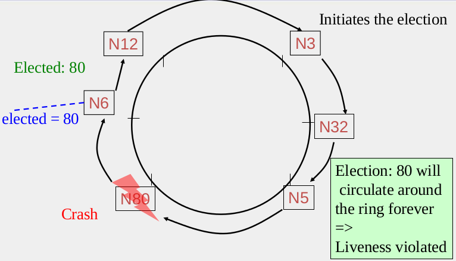

**Basic concepts**
------------------

  - Leader election algorithm must satisfy the following:
   
    1. Elect one leader only among the **non-faulty processes**
    2. All non-faulty processes agree on who is the leader
   
  - Most popular Leader election algorithms:
 
  The most popular election algorithms can be classified into multiple categories, a classical leader election protocols such
  as (Ring protocol/algorithm), Paxos-like approaches such as Google CHUBBY and zookeeper and Raft consensus such as Consul.  
   1. **Ring** 
   
       
      
      * N processes/nodes are organized in a logical ring.
      * Any node can initiate election in case of leader failure.
      * Each node send message to its successor containing the leader ID.
      * If the current Node has a higher ID .. change the leader ID to current node ID.
      * If the first node (that initiated the election) recieves the highest ID, then it 
      send a message to all nodes containing the elected leader.
      
      
   2. **Google CHUBBY**
   
      - group of replicas need to have a master by following:
   
      
      
      * Potential leader tries to get votes from other servers
      * Each server votes for at most one leader
      * Server with majority of votes becomes new leader, informs everyone
      * Master node run election again after a period called *Master lease*
      
   3. **Zookeeper**
   
      * Apply Paxos-like protocol!
      * Each Server monitors its next higher server id
      * If that successor was the leader and it has failed .... become a new leader
      * Else: wait timeout and check successor again.

   4. **Consul**
      
      * RAFT is a consensus algorithm, which is used to maintian the fault-tolerance.
      * Each server has a state machine and log "hash table".
      * Get a command from log and check if that state machine is the same on all servers.
      * "As a result, each state machine processes the same series of commands and thus produces the same series of results 
       and arrives at the same series of states." you can read more about from [here](https://raft.github.io/)
