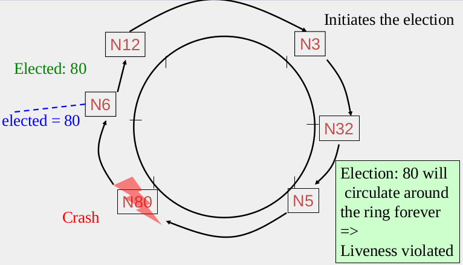
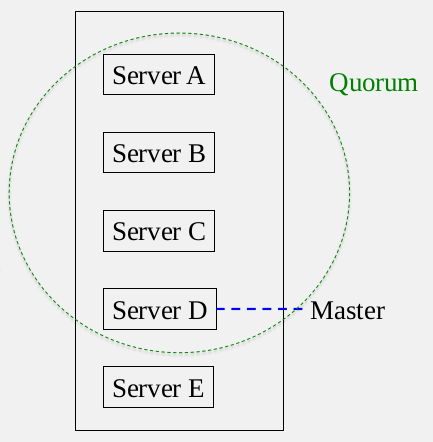

# Docker Cairo 2016 Nov. 19 (cont.)

Deploy your swarm cluster as described below. The cluster was deployed on Azure cloud. If you have any issue, don't 
hesitate to ask!!

Prerequisites:
-------------

1. Install three nodes on Windows Azure cloud

   - manager0 
   - manager1 (secondary)
   - node1
   - node2
	

  source [docker documentation](https://docs.docker.com/swarm/install-manual/)

2. Install Engine on Each node

         $ sudo apt-get update
         $ curl -sSL https://get.docker.com/ | sh

3. Configure Docker engine 

 Edit /etc/sysconfig/docker and add "-H tcp://0.0.0.0:2375 -H unix:///var/run/docker.sock"  to the OPTIONS variable.
      
      $ sudo vi /etc/default/docker
      
        ..........
        DOCKER_OPTS="--dns 8.8.8.8 --dns 8.8.4.4 -H tcp://0.0.0.0:2375 -H unix:///var/run/docker.sock"
        ..........
        ..........
        
      $ sudo /etc/init.d/docker restart
      $ sudo usermod -aG docker <USERNAME>
      $ sudo docker pull swarm
      $ sudo docker pull progrium/consul
     
4. Discovery service (Consul)

         $ sudo docker run -d -p 8500:8500 --name=consul progrium/consul -server -bootstrap

5. Start Swarm Cluster

  Start swarm manager0 & manager1 (secondary manager for high availability) 

       $ sudo docker run -d -p 4000:4000 swarm manage -H :4000 --replication --advertise <Manager_0>:4000 consul://<manager_0>:8500
       $ sudo docker run -d -p 4000:4000 swarm manage -H :4000 --replication --advertise <Manager_1>:4000 consul://<manager_0>:8500

  Connect node1 and node2 to swarm and join them to the cluster

       $ sudo docker run -d swarm join --advertise=<node_0>:2375 consul://<manager_0>:8500

6. Check manager and node status

        $ sudo docker -H :4000 info
       
       

NOTES
------

* Don't duplicate the VM or docker daemon installation. The problem is that docker generates a single ID when you install the daemon. If you duplicate the VM you will end up with two different hosts and their own IP address but with a duplicate ID from docker that swarm uses. You should reinstall the docker daemon on the second node ... source: [github issue](https://github.com/docker/swarm/issues/563)

* Regarding Consul: to create a high-availability cluster use a trio of consul nodes... for more info check out this [link](https://docs.docker.com/swarm/discovery/)

* Also  --advertise-addr so that the node can propagate that information to other nodes that subsequently connect to it.

# Node Management
-------------------

In this tutorial we are going to talk about Docker swarm node management. As we can see basic architecture as described below, we have three managers and unlimited number of workers. All workers are connected to the same network!

source: https://docs.docker.com/engine/swarm/how-swarm-mode-works/nodes/

Swarm enables docker users to manage multiple docker-engines on multiple physical/virtual hosts.... This leads to using 
different techniques such as leader election, failure detection, suspicion and consensus mechanisms to manage large number 
of services running on swarm cluster.

  **Basic concepts**
  ---------------

  - Leader election algorithm must satisfy the following:
   
    1. Elect one leader only among the **non-faulty processes**
    2. All non-faulty processes agree on who is the leader
   
  - Most popular Leader election algorithms:
 
  The most popular election algorithms can be classified into multiple categories, a classical leader election protocols such
  as (Ring protocol/algorithm), Paxos-like approaches such as Google CHUBBY and zookeeper and Raft consensus such as Consul.  
   1. **Ring** 
   
       
      
      * N processes/nodes are organized in a logical ring.
      * Any node can initiate election in case of leader failure.
      * Each node send message to its successor containing the leader ID.
      * If the current Node has a higher ID .. change the leader ID to current node ID.
      * If the first node (that initiated the election) recieves the highest ID, then it 
      send a message to all nodes containing the elected leader.
      
      
   2. **Google CHUBBY**
   
      - group of replicas need to have a master by following:
   
      
      
      * Potential leader tries to get votes from other servers
      * Each server votes for at most one leader
      * Server with majority of votes becomes new leader, informs everyone
      * Master node run election again after a period called *Master lease*
      
   3. **Zookeeper**
   
      * Apply Paxos-like protocol!
      * Each Server monitors its next higher server id
      * If that successor was the leader and it has failed .... become a new leader
      * Else: wait timeout and check successor again.

   4. **Consul**
      
      * RAFT is a consensus algorithm, which is used to maintian the fault-tolerance.
      * Each server has a state machine and log "hash table".
      * Get a command from log and check if that state machine is the same on all servers.
      * "As a result, each state machine processes the same series of commands and thus produces the same series of results 
       and arrives at the same series of states." you can read more about from [here](https://raft.github.io/)
   

1. Managers
------------

* Managers are used to **maintaining cluster state** by implementing [RAFT](https://raft.github.io/raft.pdf) consensus algorithm. 
* To satisty the high availability of service, we have to replicate our services but we need a leader to coordinate communication among distributed servers. 
* Docker recommends a maximum of **seven manager nodes** for a swarm!, but this doesn't increase the performance. 

2. Workers
------------

* Worker nodes mainly execute containers using Docker Engine.
* You have to deploy at least one manager to be able to start worker 
* By default, all managers are defined as workers.
* As a result, you can set the availabily value to "drain" in order to prevent scheduler from setting tasks on managers

# Operations on nodes
----------------------

   **List Nodes:**
   ---------------------
	Run the following commands on manager:

		   $ sudo docker node ls

    **Inspect node:**
    -------------

		   $ sudo docker node inspect baqteepnex4d2wuxnd0bresu0 --pretty 
		   ID:                     baqteepnex4d2wuxnd0bresu0
		   Hostname:               dockercairo
		   Joined at:              2016-11-18 14:56:56.91974244 +0000 utc
		   Status:
			State:                 Ready
		   Availability:          Active
		   Manager Status:
		   Address:               100.109.108.132:2377
		   Raft Status:           Reachable
			Leader:                Yes
		   Platform:
			Operating System:      linux
			Architecture:          x86_64
		   Resources:
			CPUs:                  4
			Memory:                6.804 GiB
		   Plugins:
			Network:              bridge, host, null, overlay
			Volume:               local
		   Engine Version:         1.12.3

		   # show self inspect
		   $ sudo docker node inspect self --pretty

   **Update node:**
   ------------

	update node label

		   $ sudo docker node update --label-add foo --label-add bar=baz aun655dx7djrr4x06il5c7g46

	To prevent the scheduler from placing tasks on a manager node in a multi-node swarm, set the availability for the manager node to Drain.
	 
		   $ sudo docker node update --availability drain baqteepnex4d2wuxnd0bresu0
		   
		   $ sudo docker node ls 
			ID                           HOSTNAME               STATUS  AVAILABILITY  MANAGER STATUS
			aun655dx7djrr4x06il5c7g46    localhost.localdomain  Ready   Active        
			baqteepnex4d2wuxnd0bresu0 *  dockercairo            Ready   Drain         Leader
			bfhbnpelvbu9igdm1yr77ep58    worker2                Ready   Active        

   **Change node role:**
   -----------------

	In case of manager maintaince, You can make worker node acts as manager using "promote" and "demote".

	To promote worker to be a manager:

			$ sudo docker node promote <NODE ID>
		
	To demote manager to be a worker again ... use demote argument as shown below

			$ sudo docker node demote <NODE ID>

   **Add/Remove nodes:**
   ----------------------
   We showed how we can let node joins swarm cluster by using "swarm join" (see Prerequisites section)... Also, swarm enable
   user to remove nodes from cluster using "swarm leave". Run the following command on node **NOT MANAGER**
              
	   $ sudo docker swarm leave  
	
   **Deploy & scale a serveice:**
   -----------------------------
   
           $ sudo docker service create --replicas 2 --name helloworld alpine ping docker.com
	   $ sudo docker -H :4000 ps
	   # scale service 
	   $ sudo docker service scale helloworld=4

